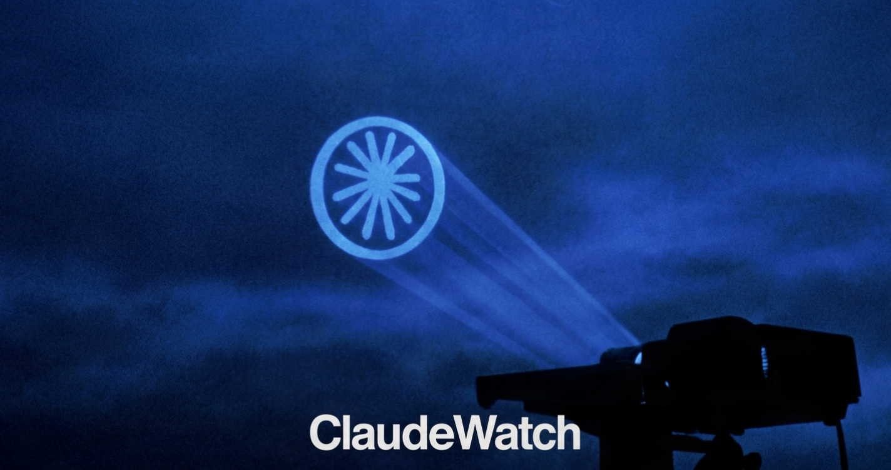

# ClaudeWatch



<p align="center">
  
</p>

<p align="center">
  <strong>Community-driven transparency for Claude usage limits.</strong><br/>
  A Chrome extension that captures anonymous usage metadata from claude.ai and feeds a public dashboard — because Anthropic doesn't publish this information.
</p>

<p align="center">
  <a href="https://github.com/guillo-tine/claudewatch/releases/latest"></a>
  
  
  
</p>

> **No message content is ever collected or transmitted.** Only token counts (integers), response times, and rate-limit booleans leave your browser.

---

## Repository Structure

```
claudewatch/
├── claudewatch-v1.0.2/     Chrome extension (Manifest V3) — load this folder
│   ├── manifest.json
│   ├── background.js       Service worker: identity, polling, Supabase submission
│   ├── content.js          Injected into claude.ai: captures exchange metadata
│   ├── interceptor.js      Runs in MAIN world: intercepts fetch/SSE streams
│   ├── popup/              Extension popup UI (3 tabs: stats, community, settings)
│   ├── lib/
│   │   └── tokenizer.js    Pure-JS BPE token estimator (no network, no WASM required)
│   ├── platforms/
│   │   └── claude.js       claude.ai DOM adapter (future: chatgpt.js, gemini.js)
│   └── icons/
├── dashboard/              Vercel / Next.js public dashboard
│   ├── pages/              index.jsx (charts), community.jsx, me.jsx (personal stats)
│   ├── components/         StatCard, RangeToggle
│   └── lib/                supabase.js, chartUtils.js
├── supabase/
│   └── migrations/         Versioned SQL migrations (schema, RLS, triggers, RPCs)
├── assets/                 Banner and logo images
└── docs/
    ├── privacy-policy.md
    ├── about.md
    └── chrome-store-description.md
```

---

## Install (pre-built)

1. Download `claudewatch-v1.0.2.zip` from the [latest release](https://github.com/guillo-tine/claudewatch/releases/latest)
2. Unzip it
3. Open Chrome → `chrome://extensions` → Enable **Developer mode** → **Load unpacked** → select the unzipped folder

---

## Quick Start (self-hosted)

### 1. Supabase

1. Create a free project at [supabase.com](https://supabase.com)
2. Run all files in `supabase/migrations/` in order in the SQL editor
3. Copy your **project URL** and **anon public key**

### 2. Extension

1. Open `claudewatch-v1.0.2/background.js` and replace `SUPABASE_URL` / `SUPABASE_ANON_KEY` with your values
2. Open Chrome → `chrome://extensions` → Enable Developer mode → Load unpacked → select `claudewatch-v1.0.2/`

### 3. Dashboard

```bash
cd dashboard
npm install
```

Create `.env.local`:
```
NEXT_PUBLIC_SUPABASE_URL=https://YOUR_PROJECT.supabase.co
NEXT_PUBLIC_SUPABASE_ANON_KEY=YOUR_ANON_KEY
```

```bash
npm run dev      # local
npm run build    # production
```

Deploy to Vercel: connect the `dashboard/` directory as a Vercel project root.

---

## How It Works

### Data Collection (extension)

The content script (`content.js`) injects into every claude.ai page and uses a `MutationObserver` to detect when a message is sent and when the response stream completes. It records:

- Estimated token counts (computed locally, text is never sent)
- Model name and whether Adaptive/extended thinking mode is on
- Response duration and derived tokens-per-second
- Whether a rate-limit or usage-limit message appeared
- Your usage percentage (polled from the settings page every 15 minutes)

All DOM selectors use `data-testid` and `aria-label` attributes where possible, which are more stable than obfuscated CSS class names. If a selector breaks, the extension fails silently and logs the error locally — it never crashes the page.

### Identity

On first install, the extension generates:
- A UUID v4 `anonymousId` — your pseudonym in the database
- A SHA-256 hash of browser/device characteristics — used server-side only to detect duplicate registrations

Neither is linked to your claude.ai account or your real identity.

### Submission

Exchanges are batched and submitted to Supabase with a minimum 30-second cooldown per install. Failed submissions queue locally (max 50) and retry automatically. The extension never uses the Supabase service role key — only the public anon key.

### Anti-abuse

Server-side protections (Postgres triggers + RLS):
- Max 2 exchange inserts per anonymous ID per 30 seconds
- Max 10 community posts per anonymous ID per 24 hours
- Device fingerprint appearing across >5 anonymous IDs → all flagged as suspicious and excluded from aggregates
- Numeric field range validation (e.g. tokens < 500,000)
- Community posts: 280 char max, no links, 3-flag auto-hide

### Dashboard

The Next.js dashboard reads from Supabase (public anon key, RLS allows SELECT) and polls every 60 seconds. No WebSocket connection is needed at this scale. Charts use [Recharts](https://recharts.org).

---

## Platform Expansion

The claude.ai-specific DOM logic is isolated in `claudewatch-v1.0.2/platforms/claude.js`. To add a new platform:

1. Create `platforms/chatgpt.js` implementing the same exported functions
2. Add a new `content_scripts` entry in `manifest.json` matching the new domain
3. Update `content.js` to import the correct platform adapter based on `window.location.hostname`

---

## What Is Not Built Yet

The following are planned but out of scope for this initial build:

- **Chrome Web Store submission** — requires developer account, privacy policy URL, and screenshots
- **Developer admin dashboard** — internal view of raw data, suspicious account management
- **Firefox port** — Manifest V3 is now supported in Firefox but the service worker model differs slightly
- **Landing / marketing page** — currently only the functional dashboard exists
- **User authentication** — all data is anonymous by design; no auth system is planned
- **WASM tokenizer** — the current tokenizer is a pure-JS BPE approximation; a full `cl100k_base` WASM bundle would be more accurate but adds ~5MB to the extension

---

## License

MIT. See LICENSE.
